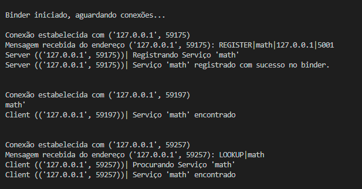
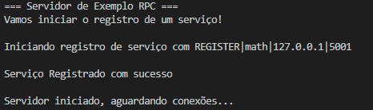
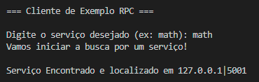
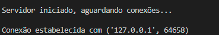
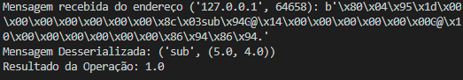
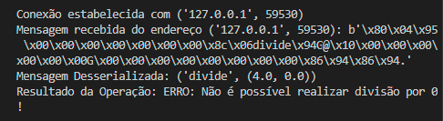
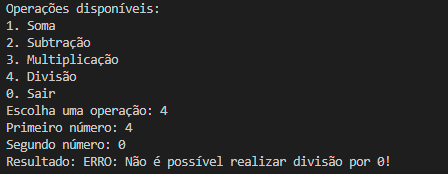

# Biblioteca RPC
 
Implementação de uma biblioteca RPC (Remote Procedure Call) usando apenas bibliotecas padrão do Python, permitindo chamar funções remotamente como se fossem locais. O sistema inclui descoberta e registro de serviços via Binder.

## Estrutura do projeto

```python
biblioteca_rpc/
├── rpc/                      # Código da biblioteca
│   ├── rpc_binder.py         # Serviço de registro/descoberta
│   ├── rpc_server.py         # Implementação do servidor RPC
│   ├── rpc_client.py         # Cliente RPC básico
│   ├── rpc_stub_generator.py # Gerador de stubs
│   └── serializer.py         # Serialização/desserialização
│
├── interface/                # Interfaces de serviço
│   └── math_service.py       # Exemplo: serviço matemático
│
├── examples/                 # Exemplos de uso
│   ├── server_example.py     # Servidor de exemplo
│   └── client_example.py     # Cliente de exemplo
│
└── README.md                 # Este arquivo
```

## Como iniciar o Binder, Servidor e Cliente.

Para executar a implementação da biblioteca RPC, primeiro, é necessário iniciar o binder, em seguida o servidor de exemplo, que instancia o servidor RPC, e por fim, é necessário executar o cliente de exemplo, que instancia o cliente RPC. Abaixo está apresentado como cada componente deve ser executado na linha de comando.

**1. Binder**

```sh
    python -m rpc.rpc_binder
```

**2. Servidor**

```sh
    python -m examples.server_example
```

**3. Cliente**

```sh
    python -m examples.client_example
```

## Como adicionar novos serviços à biblioteca

Para adicionar novos serviços à biblioteca RPC temos alguns passos:

1. Criar serviço em ```interface/```

2. Adicionar uma instância do serviço no dicionário services da classe Server em rpc_server:
```py
    self.services = {
                'math': math_service.DistributedCalculator()
                'example': service.ServiceClass()
            }
```

3. Adicione os exemplos que serão registrados em server_example e chame a função start_service_register da instância de rpc_server:
```py
    service_1 = "math"
    service_2 = "example"
    ...
    server.start_service_register(service_1)
    server.start_service_register(service_2)
```

## Exemplos de execução

**Registro e Busca no Binder:**



**Servidor registrando o serviço 'math':**



**Cliente buscando serviço 'math':**



**Servidor iniciando e aguardando conexões com o cliente:**



**Cliente utilizando as funções do serviço 'math':**


**Processamento da mensagem do cliente e resultado pelo servidor:**



**Exemplo de divisão por zero:**

**Server:**



**Client:**


